# Diagramas de Secuencia de Diseño (UML) — Ciclo 2
**Proyecto:** Sistema Web de Gestión de Citas Médicas — Clínica Vida Salud (Laravel + React + PostgreSQL)  
**Ciclo:** Ciclo 2 (13 casos de uso — 16 diagramas)  
**Compatibilidad:** Renderizable en https://www.planttext.com/

---

### CU-06 — Gestionar mi perfil — Actualizar datos de contacto y antecedentes médicos

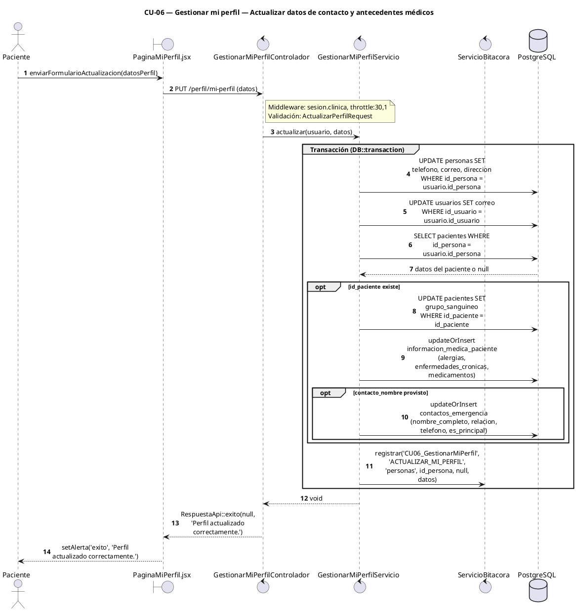
```plantuml
@startuml
title CU-06 — Gestionar mi perfil — Actualizar datos de contacto y antecedentes médicos
autonumber
skinparam shadowing false
skinparam sequenceMessageAlign center
skinparam maxMessageSize 180

actor "Paciente" as P
boundary "PaginaMiPerfil.jsx" as B
control "GestionarMiPerfilControlador" as C
control "GestionarMiPerfilServicio" as S
control "ServicioBitacora" as BIT
database "PostgreSQL" as DB

P -> B: enviarFormularioActualizacion(datosPerfil)
B -> C: PUT /perfil/mi-perfil (datos)
note right of C: Middleware: sesion.clinica, throttle:30,1\nValidación: ActualizarPerfilRequest

C -> S: actualizar(usuario, datos)

group Transacción (DB::transaction)
    S -> DB: UPDATE personas SET telefono, correo, direccion\nWHERE id_persona = usuario.id_persona
    S -> DB: UPDATE usuarios SET correo\nWHERE id_usuario = usuario.id_usuario
    S -> DB: SELECT pacientes WHERE id_persona = usuario.id_persona
    DB --> S: datos del paciente o null

    opt id_paciente existe
        S -> DB: UPDATE pacientes SET grupo_sanguineo\nWHERE id_paciente = id_paciente
        S -> DB: updateOrInsert informacion_medica_paciente\n(alergias, enfermedades_cronicas, medicamentos)
        opt contacto_nombre provisto
            S -> DB: updateOrInsert contactos_emergencia\n(nombre_completo, relacion, telefono, es_principal)
        end
    end

    S -> BIT: registrar('CU06_GestionarMiPerfil', 'ACTUALIZAR_MI_PERFIL', 'personas', id_persona, null, datos)
end

S --> C: void
C --> B: RespuestaApi::exito(null, 'Perfil actualizado correctamente.')
B --> P: setAlerta('exito', 'Perfil actualizado correctamente.')
@enduml
```

---

### CU-11 — Suspender horario y citas afectadas — Suspender horario médico

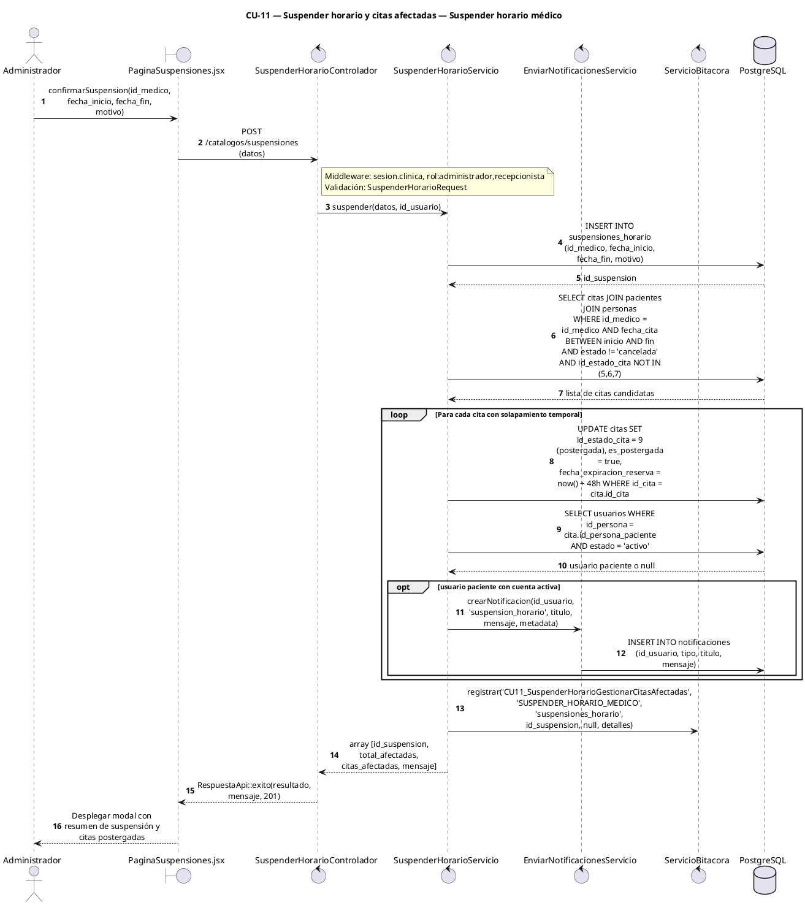
```plantuml
@startuml
title CU-11 — Suspender horario y citas afectadas — Suspender horario médico
autonumber
skinparam shadowing false
skinparam sequenceMessageAlign center
skinparam maxMessageSize 180

actor "Administrador" as A
boundary "PaginaSuspensiones.jsx" as B
control "SuspenderHorarioControlador" as C
control "SuspenderHorarioServicio" as S
control "EnviarNotificacionesServicio" as NOTIF
control "ServicioBitacora" as BIT
database "PostgreSQL" as DB

A -> B: confirmarSuspension(id_medico, fecha_inicio, fecha_fin, motivo)
B -> C: POST /catalogos/suspensiones (datos)
note right of C: Middleware: sesion.clinica, rol:administrador,recepcionista\nValidación: SuspenderHorarioRequest

C -> S: suspender(datos, id_usuario)

S -> DB: INSERT INTO suspensiones_horario (id_medico, fecha_inicio, fecha_fin, motivo)
DB --> S: id_suspension

S -> DB: SELECT citas JOIN pacientes JOIN personas\nWHERE id_medico = id_medico AND fecha_cita BETWEEN inicio AND fin\nAND estado != 'cancelada' AND id_estado_cita NOT IN (5,6,7)
DB --> S: lista de citas candidatas

loop Para cada cita con solapamiento temporal
    S -> DB: UPDATE citas SET id_estado_cita = 9 (postergada), es_postergada = true,\nfecha_expiracion_reserva = now() + 48h WHERE id_cita = cita.id_cita
    S -> DB: SELECT usuarios WHERE id_persona = cita.id_persona_paciente AND estado = 'activo'
    DB --> S: usuario paciente o null
    opt usuario paciente con cuenta activa
        S -> NOTIF: crearNotificacion(id_usuario, 'suspension_horario', titulo, mensaje, metadata)
        NOTIF -> DB: INSERT INTO notificaciones (id_usuario, tipo, titulo, mensaje)
    end
end

S -> BIT: registrar('CU11_SuspenderHorarioGestionarCitasAfectadas', 'SUSPENDER_HORARIO_MEDICO', 'suspensiones_horario', id_suspension, null, detalles)

S --> C: array [id_suspension, total_afectadas, citas_afectadas, mensaje]
C --> B: RespuestaApi::exito(resultado, mensaje, 201)
B --> A: Desplegar modal con resumen de suspensión y citas postergadas
@enduml
```

---

### CU-11 — Suspender horario y citas afectadas — Reubicar cita médica postergada

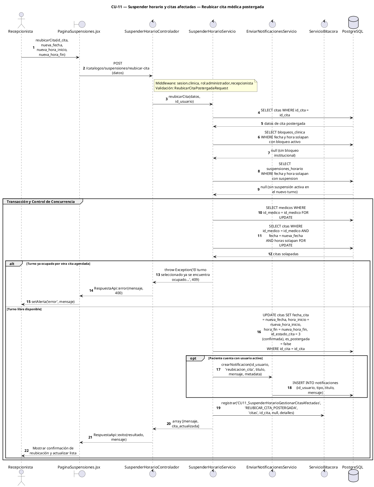
```plantuml
@startuml
title CU-11 — Suspender horario y citas afectadas — Reubicar cita médica postergada
autonumber
skinparam shadowing false
skinparam sequenceMessageAlign center
skinparam maxMessageSize 180

actor "Recepcionista" as R
boundary "PaginaSuspensiones.jsx" as B
control "SuspenderHorarioControlador" as C
control "SuspenderHorarioServicio" as S
control "EnviarNotificacionesServicio" as NOTIF
control "ServicioBitacora" as BIT
database "PostgreSQL" as DB

R -> B: reubicarCita(id_cita, nueva_fecha, nueva_hora_inicio, nueva_hora_fin)
B -> C: POST /catalogos/suspensiones/reubicar-cita (datos)
note right of C: Middleware: sesion.clinica, rol:administrador,recepcionista\nValidación: ReubicarCitaPostergadaRequest

C -> S: reubicarCita(datos, id_usuario)

S -> DB: SELECT citas WHERE id_cita = id_cita
DB --> S: datos de cita postergada

S -> DB: SELECT bloqueos_clinica WHERE fecha y hora solapan con bloqueo activo
DB --> S: null (sin bloqueo institucional)

S -> DB: SELECT suspensiones_horario WHERE fecha y hora solapan con suspension
DB --> S: null (sin suspensión activa en el nuevo turno)

group Transacción y Control de Concurrencia
    S -> DB: SELECT medicos WHERE id_medico = id_medico FOR UPDATE
    S -> DB: SELECT citas WHERE id_medico = id_medico AND fecha = nueva_fecha\nAND horas solapan FOR UPDATE
    DB --> S: citas solapadas

    alt Turno ya ocupado por otra cita agendada
        S --> C: throw Exception('El turno seleccionado ya se encuentra ocupado...', 409)
        C --> B: RespuestaApi::error(mensaje, 400)
        B --> R: setAlerta('error', mensaje)
    else Turno libre disponible
        S -> DB: UPDATE citas SET fecha_cita = nueva_fecha, hora_inicio = nueva_hora_inicio,\nhora_fin = nueva_hora_fin, id_estado_cita = 3 (confirmada), es_postergada = false\nWHERE id_cita = id_cita
        opt Paciente cuenta con usuario activo
            S -> NOTIF: crearNotificacion(id_usuario, 'reubicacion_cita', titulo, mensaje, metadata)
            NOTIF -> DB: INSERT INTO notificaciones (id_usuario, tipo, titulo, mensaje)
        end
        S -> BIT: registrar('CU11_SuspenderHorarioGestionarCitasAfectadas', 'REUBICAR_CITA_POSTERGADA', 'citas', id_cita, null, detalles)
        S --> C: array [mensaje, cita_actualizada]
        C --> B: RespuestaApi::exito(resultado, mensaje)
        B --> R: Mostrar confirmación de reubicación y actualizar lista
    end
end
@enduml
```

---

### CU-11 — Suspender horario y citas afectadas — Levantar suspensión de horario médico

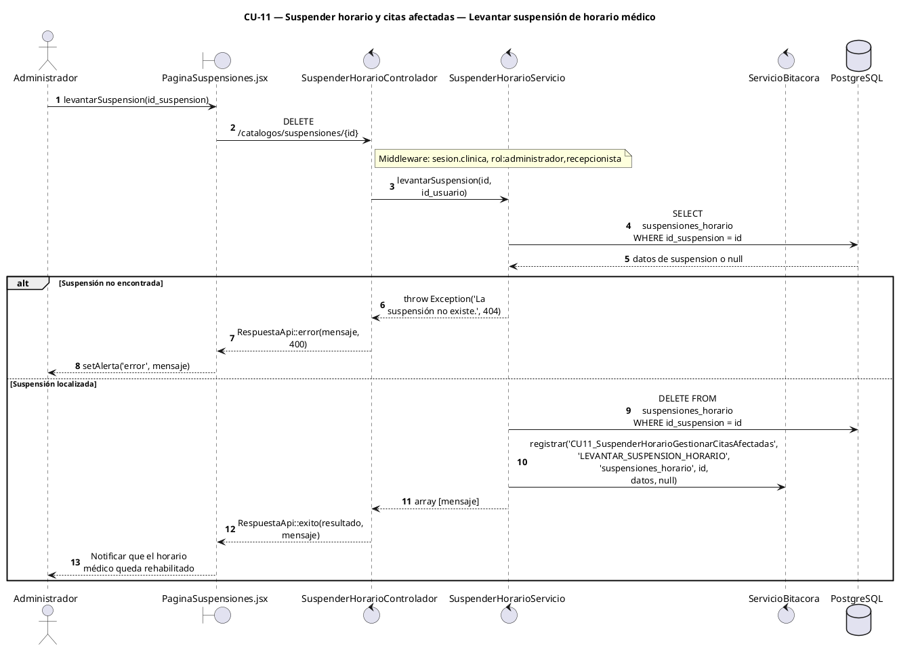
```plantuml
@startuml
title CU-11 — Suspender horario y citas afectadas — Levantar suspensión de horario médico
autonumber
skinparam shadowing false
skinparam sequenceMessageAlign center
skinparam maxMessageSize 180

actor "Administrador" as A
boundary "PaginaSuspensiones.jsx" as B
control "SuspenderHorarioControlador" as C
control "SuspenderHorarioServicio" as S
control "ServicioBitacora" as BIT
database "PostgreSQL" as DB

A -> B: levantarSuspension(id_suspension)
B -> C: DELETE /catalogos/suspensiones/{id}
note right of C: Middleware: sesion.clinica, rol:administrador,recepcionista

C -> S: levantarSuspension(id, id_usuario)

S -> DB: SELECT suspensiones_horario WHERE id_suspension = id
DB --> S: datos de suspension o null

alt Suspensión no encontrada
    S --> C: throw Exception('La suspensión no existe.', 404)
    C --> B: RespuestaApi::error(mensaje, 400)
    B --> A: setAlerta('error', mensaje)
else Suspensión localizada
    S -> DB: DELETE FROM suspensiones_horario WHERE id_suspension = id
    S -> BIT: registrar('CU11_SuspenderHorarioGestionarCitasAfectadas', 'LEVANTAR_SUSPENSION_HORARIO', 'suspensiones_horario', id, datos, null)
    S --> C: array [mensaje]
    C --> B: RespuestaApi::exito(resultado, mensaje)
    B --> A: Notificar que el horario médico queda rehabilitado
end
@enduml
```

---

### CU-16 — Enviar notificaciones y recordatorios — Disparar recordatorios de citas del día siguiente

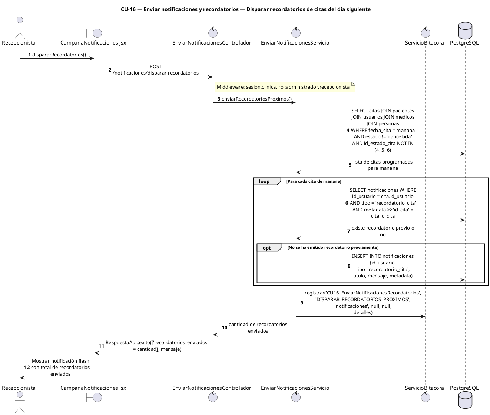
```plantuml
@startuml
title CU-16 — Enviar notificaciones y recordatorios — Disparar recordatorios de citas del día siguiente
autonumber
skinparam shadowing false
skinparam sequenceMessageAlign center
skinparam maxMessageSize 180

actor "Recepcionista" as R
boundary "CampanaNotificaciones.jsx" as B
control "EnviarNotificacionesControlador" as C
control "EnviarNotificacionesServicio" as S
control "ServicioBitacora" as BIT
database "PostgreSQL" as DB

R -> B: dispararRecordatorios()
B -> C: POST /notificaciones/disparar-recordatorios
note right of C: Middleware: sesion.clinica, rol:administrador,recepcionista

C -> S: enviarRecordatoriosProximos()

S -> DB: SELECT citas JOIN pacientes JOIN usuarios JOIN medicos JOIN personas\nWHERE fecha_cita = manana AND estado != 'cancelada'\nAND id_estado_cita NOT IN (4, 5, 6)
DB --> S: lista de citas programadas para manana

loop Para cada cita de manana
    S -> DB: SELECT notificaciones WHERE id_usuario = cita.id_usuario\nAND tipo = 'recordatorio_cita' AND metadata->>'id_cita' = cita.id_cita
    DB --> S: existe recordatorio previo o no
    opt No se ha emitido recordatorio previamente
        S -> DB: INSERT INTO notificaciones (id_usuario, tipo='recordatorio_cita', titulo, mensaje, metadata)
    end
end

S -> BIT: registrar('CU16_EnviarNotificacionesRecordatorios', 'DISPARAR_RECORDATORIOS_PROXIMOS', 'notificaciones', null, null, detalles)

S --> C: cantidad de recordatorios enviados
C --> B: RespuestaApi::exito(['recordatorios_enviados' = cantidad], mensaje)
B --> R: Mostrar notificación flash con total de recordatorios enviados
@enduml
```

---

### CU-17 — Consultar mis pacientes (kardex digital) — Consultar kardex de pacientes asignados

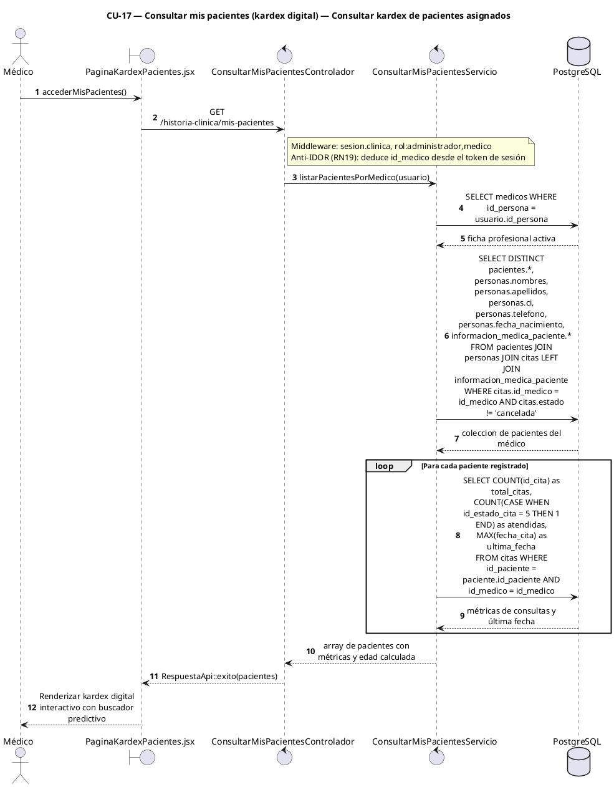
```plantuml
@startuml
title CU-17 — Consultar mis pacientes (kardex digital) — Consultar kardex de pacientes asignados
autonumber
skinparam shadowing false
skinparam sequenceMessageAlign center
skinparam maxMessageSize 180

actor "Médico" as M
boundary "PaginaKardexPacientes.jsx" as B
control "ConsultarMisPacientesControlador" as C
control "ConsultarMisPacientesServicio" as S
database "PostgreSQL" as DB

M -> B: accederMisPacientes()
B -> C: GET /historia-clinica/mis-pacientes
note right of C: Middleware: sesion.clinica, rol:administrador,medico\nAnti-IDOR (RN19): deduce id_medico desde el token de sesión

C -> S: listarPacientesPorMedico(usuario)

S -> DB: SELECT medicos WHERE id_persona = usuario.id_persona
DB --> S: ficha profesional activa

S -> DB: SELECT DISTINCT pacientes.*, personas.nombres, personas.apellidos, personas.ci,\npersonas.telefono, personas.fecha_nacimiento, informacion_medica_paciente.*\nFROM pacientes JOIN personas JOIN citas LEFT JOIN informacion_medica_paciente\nWHERE citas.id_medico = id_medico AND citas.estado != 'cancelada'
DB --> S: coleccion de pacientes del médico

loop Para cada paciente registrado
    S -> DB: SELECT COUNT(id_cita) as total_citas,\nCOUNT(CASE WHEN id_estado_cita = 5 THEN 1 END) as atendidas,\nMAX(fecha_cita) as ultima_fecha\nFROM citas WHERE id_paciente = paciente.id_paciente AND id_medico = id_medico
    DB --> S: métricas de consultas y última fecha
end

S --> C: array de pacientes con métricas y edad calculada
C --> B: RespuestaApi::exito(pacientes)
B --> M: Renderizar kardex digital interactivo con buscador predictivo
@enduml
```

---

### CU-18 — Registrar atención clínica — Registrar consulta médica y concluir cita

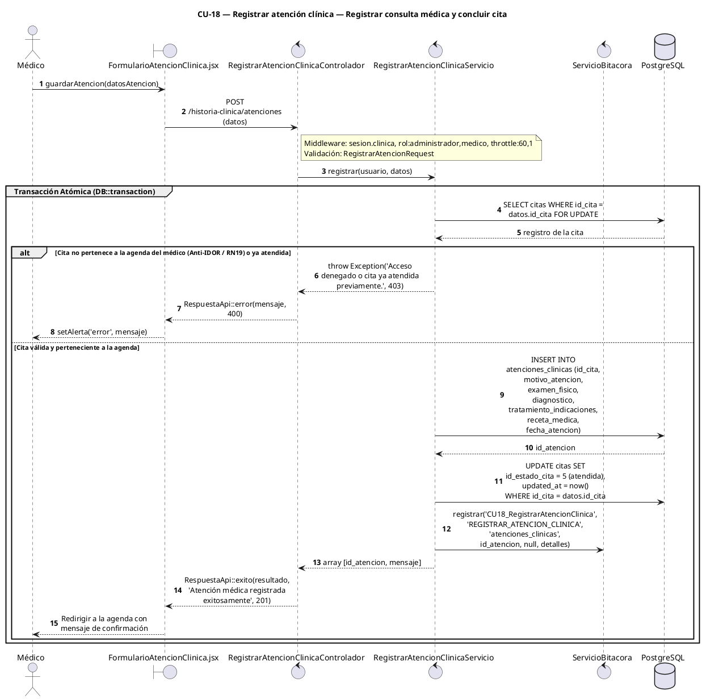
```plantuml
@startuml
title CU-18 — Registrar atención clínica — Registrar consulta médica y concluir cita
autonumber
skinparam shadowing false
skinparam sequenceMessageAlign center
skinparam maxMessageSize 180

actor "Médico" as M
boundary "FormularioAtencionClinica.jsx" as B
control "RegistrarAtencionClinicaControlador" as C
control "RegistrarAtencionClinicaServicio" as S
control "ServicioBitacora" as BIT
database "PostgreSQL" as DB

M -> B: guardarAtencion(datosAtencion)
B -> C: POST /historia-clinica/atenciones (datos)
note right of C: Middleware: sesion.clinica, rol:administrador,medico, throttle:60,1\nValidación: RegistrarAtencionRequest

C -> S: registrar(usuario, datos)

group Transacción Atómica (DB::transaction)
    S -> DB: SELECT citas WHERE id_cita = datos.id_cita FOR UPDATE
    DB --> S: registro de la cita

    alt Cita no pertenece a la agenda del médico (Anti-IDOR / RN19) o ya atendida
        S --> C: throw Exception('Acceso denegado o cita ya atendida previamente.', 403)
        C --> B: RespuestaApi::error(mensaje, 400)
        B --> M: setAlerta('error', mensaje)
    else Cita válida y perteneciente a la agenda
        S -> DB: INSERT INTO atenciones_clinicas (id_cita, motivo_atencion, examen_fisico,\ndiagnostico, tratamiento_indicaciones, receta_medica, fecha_atencion)
        DB --> S: id_atencion

        S -> DB: UPDATE citas SET id_estado_cita = 5 (atendida), updated_at = now()\nWHERE id_cita = datos.id_cita

        S -> BIT: registrar('CU18_RegistrarAtencionClinica', 'REGISTRAR_ATENCION_CLINICA',\n'atenciones_clinicas', id_atencion, null, detalles)

        S --> C: array [id_atencion, mensaje]
        C --> B: RespuestaApi::exito(resultado, 'Atención médica registrada exitosamente', 201)
        B --> M: Redirigir a la agenda con mensaje de confirmación
    end
end
@enduml
```

---

### CU-19 — Registrar resultados de laboratorio — Registrar examen auxiliar de laboratorio

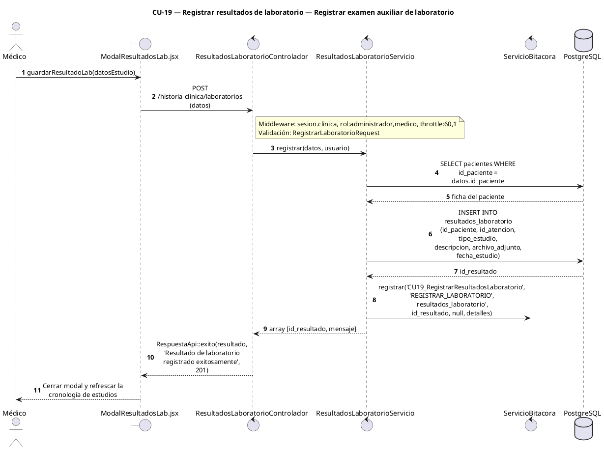
```plantuml
@startuml
title CU-19 — Registrar resultados de laboratorio — Registrar examen auxiliar de laboratorio
autonumber
skinparam shadowing false
skinparam sequenceMessageAlign center
skinparam maxMessageSize 180

actor "Médico" as M
boundary "ModalResultadosLab.jsx" as B
control "ResultadosLaboratorioControlador" as C
control "ResultadosLaboratorioServicio" as S
control "ServicioBitacora" as BIT
database "PostgreSQL" as DB

M -> B: guardarResultadoLab(datosEstudio)
B -> C: POST /historia-clinica/laboratorios (datos)
note right of C: Middleware: sesion.clinica, rol:administrador,medico, throttle:60,1\nValidación: RegistrarLaboratorioRequest

C -> S: registrar(datos, usuario)

S -> DB: SELECT pacientes WHERE id_paciente = datos.id_paciente
DB --> S: ficha del paciente

S -> DB: INSERT INTO resultados_laboratorio (id_paciente, id_atencion, tipo_estudio,\ndescripcion, archivo_adjunto, fecha_estudio)
DB --> S: id_resultado

S -> BIT: registrar('CU19_RegistrarResultadosLaboratorio', 'REGISTRAR_LABORATORIO',\n'resultados_laboratorio', id_resultado, null, detalles)

S --> C: array [id_resultado, mensaje]
C --> B: RespuestaApi::exito(resultado, 'Resultado de laboratorio registrado exitosamente', 201)
B --> M: Cerrar modal y refrescar la cronología de estudios
@enduml
```

---

### CU-20 — Consultar historial clínico — Consultar expediente clínico integral del paciente

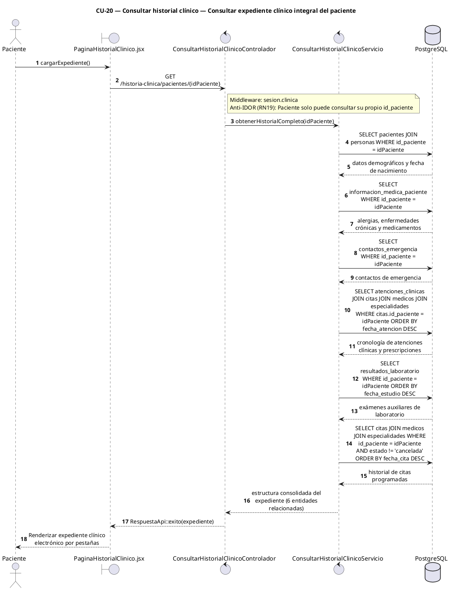
```plantuml
@startuml
title CU-20 — Consultar historial clínico — Consultar expediente clínico integral del paciente
autonumber
skinparam shadowing false
skinparam sequenceMessageAlign center
skinparam maxMessageSize 180

actor "Paciente" as P
boundary "PaginaHistorialClinico.jsx" as B
control "ConsultarHistorialClinicoControlador" as C
control "ConsultarHistorialClinicoServicio" as S
database "PostgreSQL" as DB

P -> B: cargarExpediente()
B -> C: GET /historia-clinica/pacientes/{idPaciente}
note right of C: Middleware: sesion.clinica\nAnti-IDOR (RN19): Paciente solo puede consultar su propio id_paciente

C -> S: obtenerHistorialCompleto(idPaciente)

S -> DB: SELECT pacientes JOIN personas WHERE id_paciente = idPaciente
DB --> S: datos demográficos y fecha de nacimiento

S -> DB: SELECT informacion_medica_paciente WHERE id_paciente = idPaciente
DB --> S: alergias, enfermedades crónicas y medicamentos

S -> DB: SELECT contactos_emergencia WHERE id_paciente = idPaciente
DB --> S: contactos de emergencia

S -> DB: SELECT atenciones_clinicas JOIN citas JOIN medicos JOIN especialidades\nWHERE citas.id_paciente = idPaciente ORDER BY fecha_atencion DESC
DB --> S: cronología de atenciones clínicas y prescripciones

S -> DB: SELECT resultados_laboratorio WHERE id_paciente = idPaciente ORDER BY fecha_estudio DESC
DB --> S: exámenes auxiliares de laboratorio

S -> DB: SELECT citas JOIN medicos JOIN especialidades WHERE id_paciente = idPaciente\nAND estado != 'cancelada' ORDER BY fecha_cita DESC
DB --> S: historial de citas programadas

S --> C: estructura consolidada del expediente (6 entidades relacionadas)
C --> B: RespuestaApi::exito(expediente)
B --> P: Renderizar expediente clínico electrónico por pestañas
@enduml
```

---

### CU-21 — Consultar reportes de citas — Consultar reporte operacional y distribución de citas

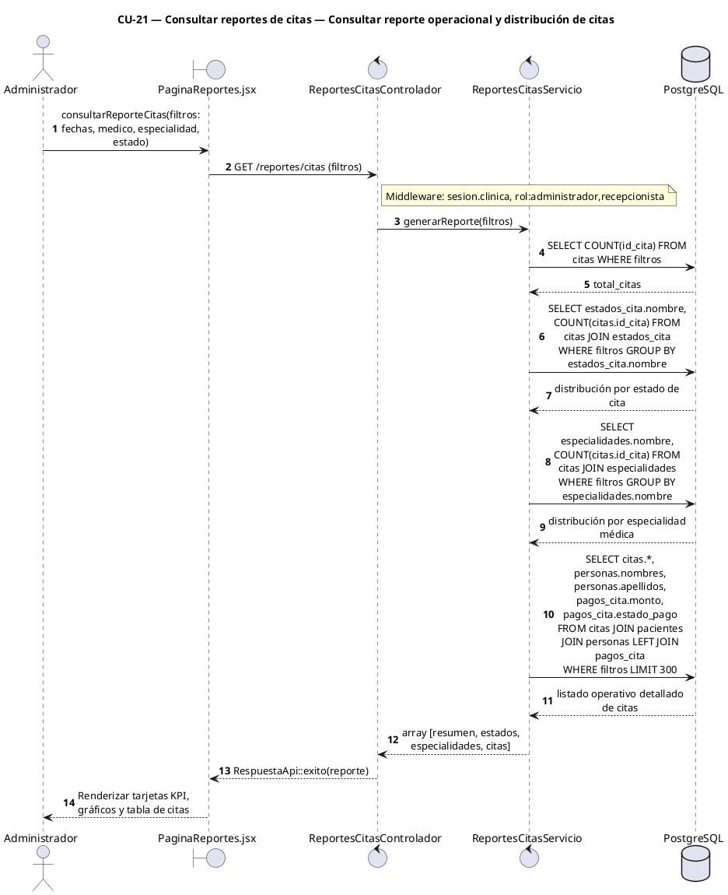
```plantuml
@startuml
title CU-21 — Consultar reportes de citas — Consultar reporte operacional y distribución de citas
autonumber
skinparam shadowing false
skinparam sequenceMessageAlign center
skinparam maxMessageSize 180

actor "Administrador" as A
boundary "PaginaReportes.jsx" as B
control "ReportesCitasControlador" as C
control "ReportesCitasServicio" as S
database "PostgreSQL" as DB

A -> B: consultarReporteCitas(filtros: fechas, medico, especialidad, estado)
B -> C: GET /reportes/citas (filtros)
note right of C: Middleware: sesion.clinica, rol:administrador,recepcionista

C -> S: generarReporte(filtros)

S -> DB: SELECT COUNT(id_cita) FROM citas WHERE filtros
DB --> S: total_citas

S -> DB: SELECT estados_cita.nombre, COUNT(citas.id_cita) FROM citas JOIN estados_cita\nWHERE filtros GROUP BY estados_cita.nombre
DB --> S: distribución por estado de cita

S -> DB: SELECT especialidades.nombre, COUNT(citas.id_cita) FROM citas JOIN especialidades\nWHERE filtros GROUP BY especialidades.nombre
DB --> S: distribución por especialidad médica

S -> DB: SELECT citas.*, personas.nombres, personas.apellidos, pagos_cita.monto, pagos_cita.estado_pago\nFROM citas JOIN pacientes JOIN personas LEFT JOIN pagos_cita\nWHERE filtros LIMIT 300
DB --> S: listado operativo detallado de citas

S --> C: array [resumen, estados, especialidades, citas]
C --> B: RespuestaApi::exito(reporte)
B --> A: Renderizar tarjetas KPI, gráficos y tabla de citas
@enduml
```

---

### CU-22 — Consultar reporte de asistencia y pacientes registrados — Consultar efectividad asistencial y ausentismo

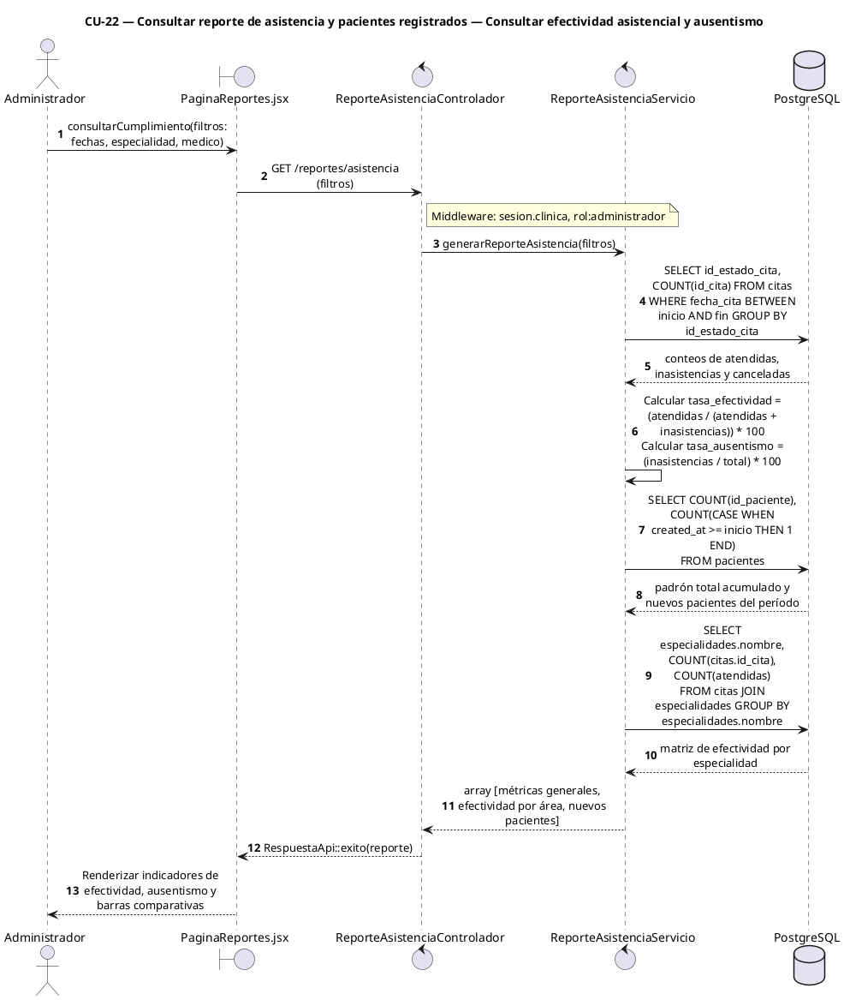
```plantuml
@startuml
title CU-22 — Consultar reporte de asistencia y pacientes registrados — Consultar efectividad asistencial y ausentismo
autonumber
skinparam shadowing false
skinparam sequenceMessageAlign center
skinparam maxMessageSize 180

actor "Administrador" as A
boundary "PaginaReportes.jsx" as B
control "ReporteAsistenciaControlador" as C
control "ReporteAsistenciaServicio" as S
database "PostgreSQL" as DB

A -> B: consultarCumplimiento(filtros: fechas, especialidad, medico)
B -> C: GET /reportes/asistencia (filtros)
note right of C: Middleware: sesion.clinica, rol:administrador

C -> S: generarReporteAsistencia(filtros)

S -> DB: SELECT id_estado_cita, COUNT(id_cita) FROM citas\nWHERE fecha_cita BETWEEN inicio AND fin GROUP BY id_estado_cita
DB --> S: conteos de atendidas, inasistencias y canceladas

S -> S: Calcular tasa_efectividad = (atendidas / (atendidas + inasistencias)) * 100\nCalcular tasa_ausentismo = (inasistencias / total) * 100

S -> DB: SELECT COUNT(id_paciente), COUNT(CASE WHEN created_at >= inicio THEN 1 END)\nFROM pacientes
DB --> S: padrón total acumulado y nuevos pacientes del período

S -> DB: SELECT especialidades.nombre, COUNT(citas.id_cita), COUNT(atendidas)\nFROM citas JOIN especialidades GROUP BY especialidades.nombre
DB --> S: matriz de efectividad por especialidad

S --> C: array [métricas generales, efectividad por área, nuevos pacientes]
C --> B: RespuestaApi::exito(reporte)
B --> A: Renderizar indicadores de efectividad, ausentismo y barras comparativas
@enduml
```

---

### CU-23 — Exportar reportes — Exportar reporte operacional de citas a formato CSV

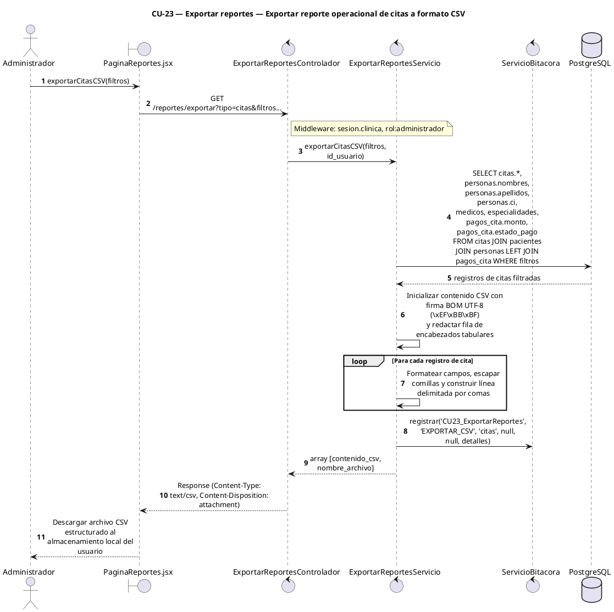
```plantuml
@startuml
title CU-23 — Exportar reportes — Exportar reporte operacional de citas a formato CSV
autonumber
skinparam shadowing false
skinparam sequenceMessageAlign center
skinparam maxMessageSize 180

actor "Administrador" as A
boundary "PaginaReportes.jsx" as B
control "ExportarReportesControlador" as C
control "ExportarReportesServicio" as S
control "ServicioBitacora" as BIT
database "PostgreSQL" as DB

A -> B: exportarCitasCSV(filtros)
B -> C: GET /reportes/exportar?tipo=citas&filtros...
note right of C: Middleware: sesion.clinica, rol:administrador

C -> S: exportarCitasCSV(filtros, id_usuario)

S -> DB: SELECT citas.*, personas.nombres, personas.apellidos, personas.ci,\nmedicos, especialidades, pagos_cita.monto, pagos_cita.estado_pago\nFROM citas JOIN pacientes JOIN personas LEFT JOIN pagos_cita WHERE filtros
DB --> S: registros de citas filtradas

S -> S: Inicializar contenido CSV con firma BOM UTF-8 (\\xEF\\xBB\\xBF)\ny redactar fila de encabezados tabulares

loop Para cada registro de cita
    S -> S: Formatear campos, escapar comillas y construir línea delimitada por comas
end

S -> BIT: registrar('CU23_ExportarReportes', 'EXPORTAR_CSV', 'citas', null, null, detalles)

S --> C: array [contenido_csv, nombre_archivo]
C --> B: Response (Content-Type: text/csv, Content-Disposition: attachment)
B --> A: Descargar archivo CSV estructurado al almacenamiento local del usuario
@enduml
```

---

### CU-24 — Consultar bitácora de auditoría — Consultar registros inmutables de auditoría con filtros

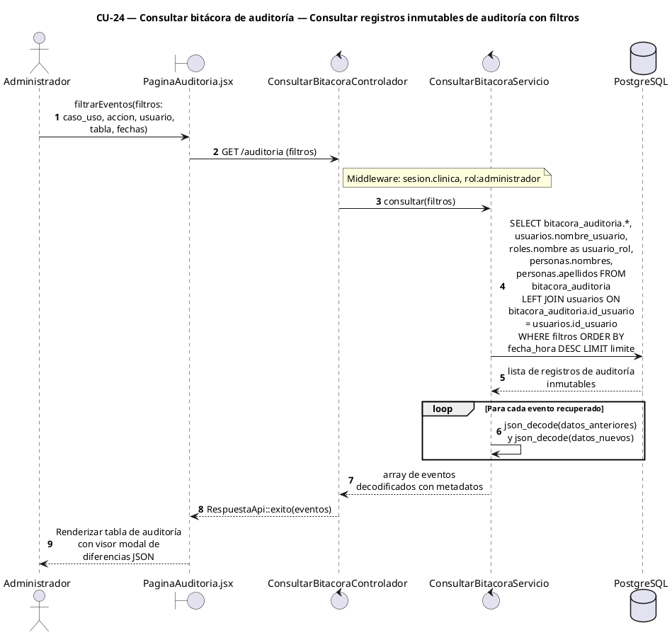
```plantuml
@startuml
title CU-24 — Consultar bitácora de auditoría — Consultar registros inmutables de auditoría con filtros
autonumber
skinparam shadowing false
skinparam sequenceMessageAlign center
skinparam maxMessageSize 180

actor "Administrador" as A
boundary "PaginaAuditoria.jsx" as B
control "ConsultarBitacoraControlador" as C
control "ConsultarBitacoraServicio" as S
database "PostgreSQL" as DB

A -> B: filtrarEventos(filtros: caso_uso, accion, usuario, tabla, fechas)
B -> C: GET /auditoria (filtros)
note right of C: Middleware: sesion.clinica, rol:administrador

C -> S: consultar(filtros)

S -> DB: SELECT bitacora_auditoria.*, usuarios.nombre_usuario, roles.nombre as usuario_rol,\npersonas.nombres, personas.apellidos FROM bitacora_auditoria\nLEFT JOIN usuarios ON bitacora_auditoria.id_usuario = usuarios.id_usuario\nWHERE filtros ORDER BY fecha_hora DESC LIMIT limite
DB --> S: lista de registros de auditoría inmutables

loop Para cada evento recuperado
    S -> S: json_decode(datos_anteriores) y json_decode(datos_nuevos)
end

S --> C: array de eventos decodificados con metadatos
C --> B: RespuestaApi::exito(eventos)
B --> A: Renderizar tabla de auditoría con visor modal de diferencias JSON
@enduml
```

---

### CU-25 — Visualizar dashboard administrativo — Consolidar KPIs y panel interactivo en tiempo real

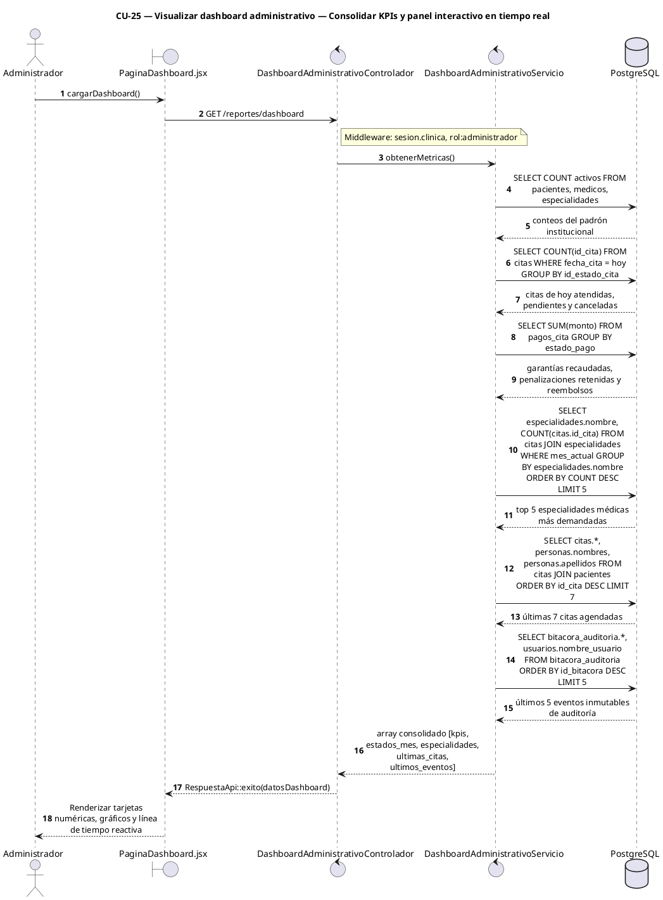
```plantuml
@startuml
title CU-25 — Visualizar dashboard administrativo — Consolidar KPIs y panel interactivo en tiempo real
autonumber
skinparam shadowing false
skinparam sequenceMessageAlign center
skinparam maxMessageSize 180

actor "Administrador" as A
boundary "PaginaDashboard.jsx" as B
control "DashboardAdministrativoControlador" as C
control "DashboardAdministrativoServicio" as S
database "PostgreSQL" as DB

A -> B: cargarDashboard()
B -> C: GET /reportes/dashboard
note right of C: Middleware: sesion.clinica, rol:administrador

C -> S: obtenerMetricas()

S -> DB: SELECT COUNT activos FROM pacientes, medicos, especialidades
DB --> S: conteos del padrón institucional

S -> DB: SELECT COUNT(id_cita) FROM citas WHERE fecha_cita = hoy GROUP BY id_estado_cita
DB --> S: citas de hoy atendidas, pendientes y canceladas

S -> DB: SELECT SUM(monto) FROM pagos_cita GROUP BY estado_pago
DB --> S: garantías recaudadas, penalizaciones retenidas y reembolsos

S -> DB: SELECT especialidades.nombre, COUNT(citas.id_cita) FROM citas JOIN especialidades\nWHERE mes_actual GROUP BY especialidades.nombre ORDER BY COUNT DESC LIMIT 5
DB --> S: top 5 especialidades médicas más demandadas

S -> DB: SELECT citas.*, personas.nombres, personas.apellidos FROM citas JOIN pacientes\nORDER BY id_cita DESC LIMIT 7
DB --> S: últimas 7 citas agendadas

S -> DB: SELECT bitacora_auditoria.*, usuarios.nombre_usuario FROM bitacora_auditoria\nORDER BY id_bitacora DESC LIMIT 5
DB --> S: últimos 5 eventos inmutables de auditoría

S --> C: array consolidado [kpis, estados_mes, especialidades, ultimas_citas, ultimos_eventos]
C --> B: RespuestaApi::exito(datosDashboard)
B --> A: Renderizar tarjetas numéricas, gráficos y línea de tiempo reactiva
@enduml
```

---

### CU-26 — Generar y restaurar copias de seguridad — Generar respaldo completo de base de datos

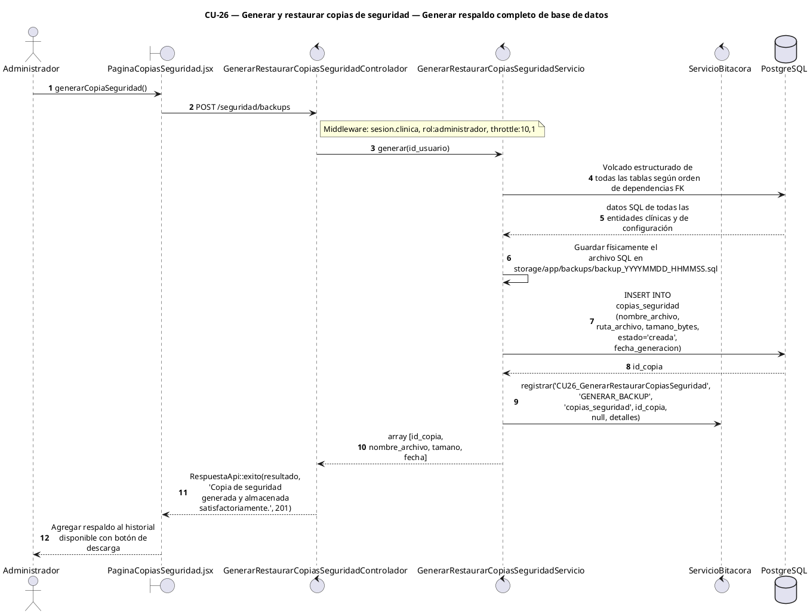
```plantuml
@startuml
title CU-26 — Generar y restaurar copias de seguridad — Generar respaldo completo de base de datos
autonumber
skinparam shadowing false
skinparam sequenceMessageAlign center
skinparam maxMessageSize 180

actor "Administrador" as A
boundary "PaginaCopiasSeguridad.jsx" as B
control "GenerarRestaurarCopiasSeguridadControlador" as C
control "GenerarRestaurarCopiasSeguridadServicio" as S
control "ServicioBitacora" as BIT
database "PostgreSQL" as DB

A -> B: generarCopiaSeguridad()
B -> C: POST /seguridad/backups
note right of C: Middleware: sesion.clinica, rol:administrador, throttle:10,1

C -> S: generar(id_usuario)

S -> DB: Volcado estructurado de todas las tablas según orden de dependencias FK
DB --> S: datos SQL de todas las entidades clínicas y de configuración

S -> S: Guardar físicamente el archivo SQL en storage/app/backups/backup_YYYYMMDD_HHMMSS.sql

S -> DB: INSERT INTO copias_seguridad (nombre_archivo, ruta_archivo, tamano_bytes,\nestado='creada', fecha_generacion)
DB --> S: id_copia

S -> BIT: registrar('CU26_GenerarRestaurarCopiasSeguridad', 'GENERAR_BACKUP',\n'copias_seguridad', id_copia, null, detalles)

S --> C: array [id_copia, nombre_archivo, tamano, fecha]
C --> B: RespuestaApi::exito(resultado, 'Copia de seguridad generada y almacenada satisfactoriamente.', 201)
B --> A: Agregar respaldo al historial disponible con botón de descarga
@enduml
```

---

### CU-26 — Generar y restaurar copias de seguridad — Restaurar base de datos desde copia de seguridad

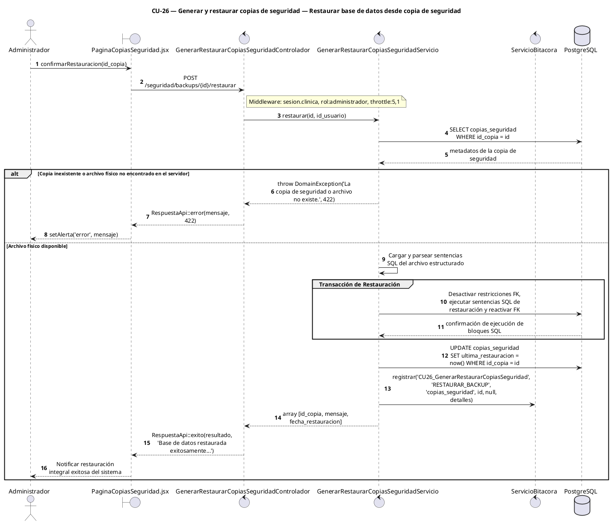
```plantuml
@startuml
title CU-26 — Generar y restaurar copias de seguridad — Restaurar base de datos desde copia de seguridad
autonumber
skinparam shadowing false
skinparam sequenceMessageAlign center
skinparam maxMessageSize 180

actor "Administrador" as A
boundary "PaginaCopiasSeguridad.jsx" as B
control "GenerarRestaurarCopiasSeguridadControlador" as C
control "GenerarRestaurarCopiasSeguridadServicio" as S
control "ServicioBitacora" as BIT
database "PostgreSQL" as DB

A -> B: confirmarRestauracion(id_copia)
B -> C: POST /seguridad/backups/{id}/restaurar
note right of C: Middleware: sesion.clinica, rol:administrador, throttle:5,1

C -> S: restaurar(id, id_usuario)

S -> DB: SELECT copias_seguridad WHERE id_copia = id
DB --> S: metadatos de la copia de seguridad

alt Copia inexistente o archivo físico no encontrado en el servidor
    S --> C: throw DomainException('La copia de seguridad o archivo no existe.', 422)
    C --> B: RespuestaApi::error(mensaje, 422)
    B --> A: setAlerta('error', mensaje)
else Archivo físico disponible
    S -> S: Cargar y parsear sentencias SQL del archivo estructurado

    group Transacción de Restauración
        S -> DB: Desactivar restricciones FK, ejecutar sentencias SQL de restauración y reactivar FK
        DB --> S: confirmación de ejecución de bloques SQL
    end

    S -> DB: UPDATE copias_seguridad SET ultima_restauracion = now() WHERE id_copia = id

    S -> BIT: registrar('CU26_GenerarRestaurarCopiasSeguridad', 'RESTAURAR_BACKUP',\n'copias_seguridad', id, null, detalles)

    S --> C: array [id_copia, mensaje, fecha_restauracion]
    C --> B: RespuestaApi::exito(resultado, 'Base de datos restaurada exitosamente...')
    B --> A: Notificar restauración integral exitosa del sistema
end
@enduml
```

